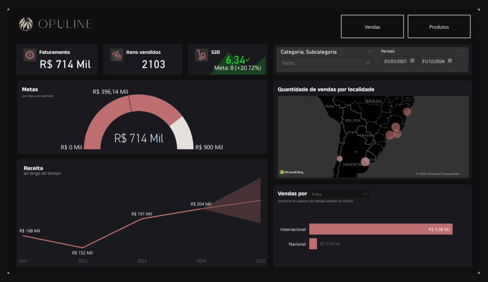
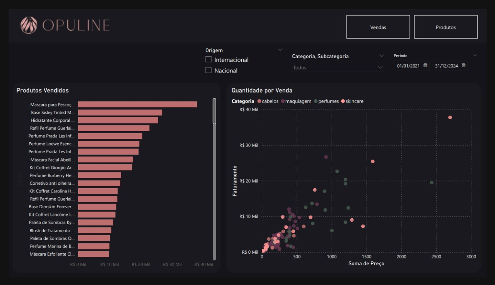

# Dashboard de Análise de Vendas - Opuline

O **Dashboard de Análise de Vendas da Opuline** é uma ferramenta interativa que permite a visualização e análise das vendas de produtos de maquiagem. Ele oferece insights valiosos sobre o desempenho de vendas, ajudando a equipe a identificar tendências e tomar decisões estratégicas.

## Descrição do Dashboard

Este dashboard é projetado para monitorar as vendas de produtos de maquiagem da Opuline, permitindo que os usuários explorem dados em tempo real e identifiquem oportunidades de crescimento.

### Funcionalidades Principais

- **Análise de Vendas**: Visualize o desempenho de vendas em diferentes categorias de produtos.
- **Comparações de Desempenho**: Compare vendas ao longo do tempo para identificar tendências.
- **Visualizações Geográficas**: Mapeie vendas por região para entender o comportamento do consumidor.
- **Interatividade**: Filtros dinâmicos para personalizar a visualização de dados conforme necessário.

## Imagens do Dashboard

Para visualizar a análise detalhada de vendas e as visualizações, consulte o link abaixo:

[Acessar o Dashboard](https://app.powerbi.com/groups/me/reports/747e959e-d67e-426c-963f-a6aac983ea45/975ddff399c05546930a?experience=power-bi)

## Como Usar

1. **Requisitos**: Certifique-se de ter acesso ao Power BI para visualizar o dashboard.
2. **Acesso ao Dashboard**: O dashboard pode ser acessado através do link compartilhado.
3. **Interação**: Utilize os filtros e seleções disponíveis para explorar diferentes visualizações e insights.

